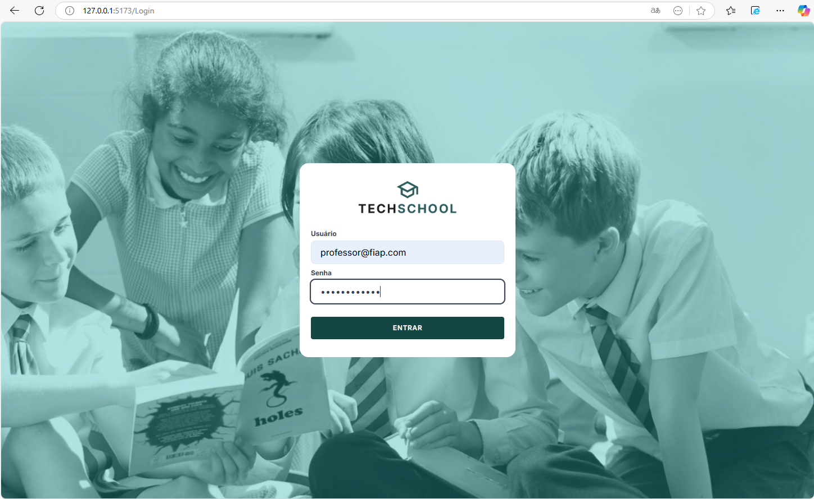
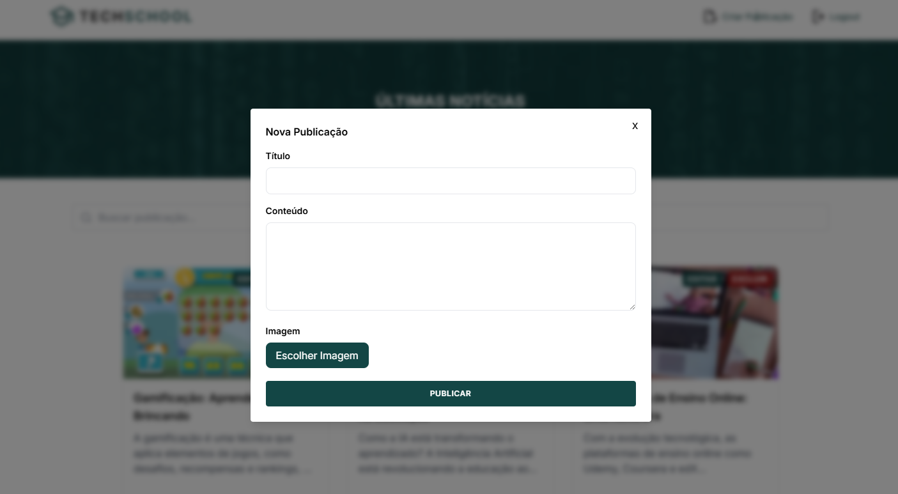
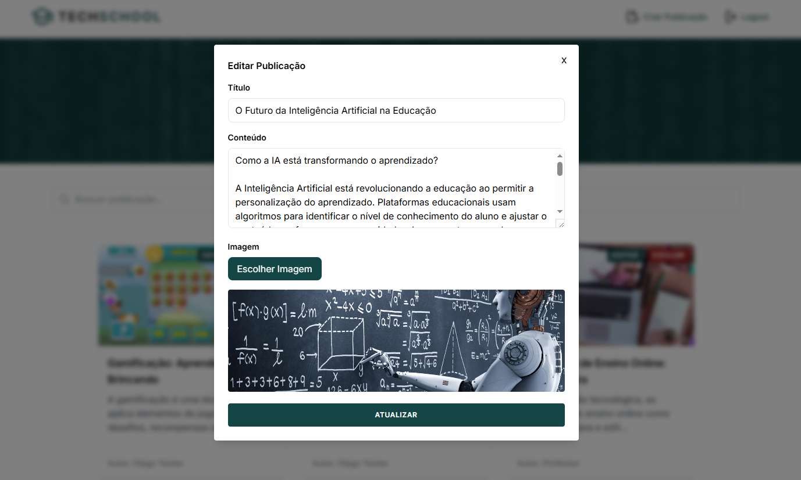
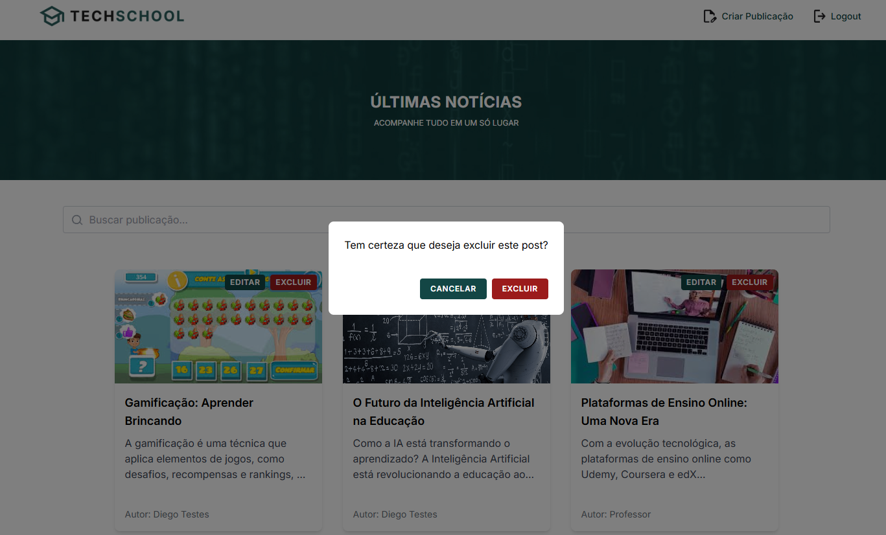

# TECH-CHALLENGE-FRONTEND

Tech Challenge Frontend é uma interface gráfica em React desenvolvida como atividade que integra os conhecimentos adquiridos durante o módulo de Frontend, Fase 3 da Pós Tech FIAP Full Stack Development, do Grupo 1, Turma 2FSDT.

Membros do grupo 1 - 2FSDT:

- RM: 357717 Cristiano Gomes da Rocha,
- RM: 357154 Diego da Silva Gervasio,
- RM: 357480 Douglas Yogi Yokomizo,
- RM: 356535 João Vitor dos Santos Correa,
- RM: 357920 Marcos Alberto Herrera Bordalo.

## Objetivo

O objetivo desta interface gráfica é fornecer uma aplicação blogging robusta, responsiva, acessível e fácil de usar, permitindo aos docentes e alunos(as) interagir e gerenciar postagens de blog por meio de operações de criação, edição, deleção e listagens de post, utilizando login de autenticação e assim facilitando a gestão de conteúdo par os autores e administradores.

---

## Video de apresentação

[Link do video de apresentação](https://drive.google.com/file/d/17Qe8B81myaIwwkWmZV0VruY_SG76iepM/view?usp=drive_link)

---

## Tecnologias utilizadas no frontend

- React
- Axios
- Tailwind
- Tanstack
- Docker

---

## Instalação da aplicação

Este projeto está pronto para ser executado em um ambiente Docker. Por este motivo, será necessária apenas a instalação do Docker, não sendo necessária a instalação manual do projeto.

Caso não tenha o Docker instalado, siga as instruções para seu sistema operacional na [documentação oficial do Docker](https://docs.docker.com/get-started/get-docker/).

- Subir a aplicação utilizando Docker:

```bash
docker-compose up --build
```

---

## Usúario de testes

```bash
user: professor@fiap.com
key: password1234
```

---

## Telas da aplicação

Tela 1: Home - Listagem de Posts

- Exibe uma lista de posts disponíveis limitado a 6 posts por página,
- Permite que todos usuários naveguem para as páginas de visualização de um post,
- Permite que todos usuários façam a busca de um post pelo campo de busca,
- Permite que o administrador faça login.


Tela 2: Login – Professor

- Exibe o formulário para o professor fazer a autenticação e gestão do conteúdo.



Tela 3: Página de administração

- Exibe o conteúdo detalhado de um post selecionado,
- Oferece opções para criação, edição ou exclusão de um post somente para professores logados,
- Oferece opçãoa de logout para o professor que estiver logado.


Tela 4: Criação de Post

- Permite que o professor crie um novo post, inserindo título, conteúdo, imagem  e outras informações relevantes.



Tela 5: Edição de Post

- Permite que o professor edite um post existente.



Tela 6: Exclusão de Post

- Permite que o professor exclua um post existente.



---

## Back-End utilizado

Este repositório contém a implementação do back-end do **Tech Challenge 2** com algumas adaptações.

O sistema está em produção e foi desenvolvido com base nas especificações fornecidas, utilizando o front-end do **Tech Challenge 3**

A API está totalmente documentada usando o Swagger. Você pode acessar a documentação interativa da API através do seguinte link:

[Documentação da API (Swagger)](https://tech-challenge-back-end.vercel.app/api-docs#/)

### Tecnologias utilizadas no backend

- Linguagem: Node.js
- Framework: Express
- Banco de Dados:  MongoDB
- Documentação: Swagger
- Deploy: Vercel

---

## Relato de experiências e desafios

Desde o início, o grupo decidiu versionar o código diretamente no GitHub, o que permitiu uma organização eficiente da estrutura inicial e dos padrões do projeto. A cada etapa da implementação da interface, todos os integrantes eram notificados sobre novos Pull Requests (PRs) abertos na branch principal, garantindo a colaboração contínua e a revisão conjunta do código.

As aulas da Fase 3 foram fundamentais para o desenvolvimento do projeto, fornecendo a base necessária para avançarmos com confiança. Sempre que surgiam dúvidas ou obstáculos, reassistir as aulas ou buscar soluções na internet tornou o processo de resolução de problemas mais ágil e eficaz.

Além disso, os encontros semanais de todo o grupo desempenharam um papel crucial, promovendo discussões e alinhamentos que contribuíram para o progresso contínuo e a conclusão bem-sucedida do projeto.
